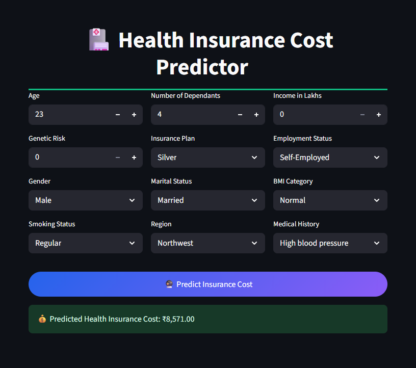
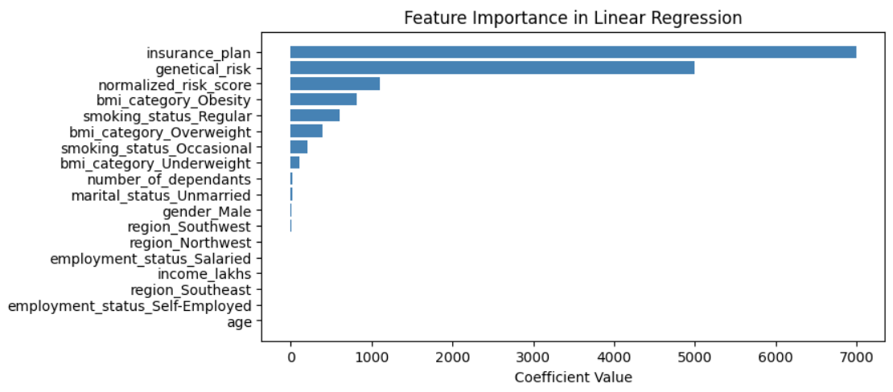
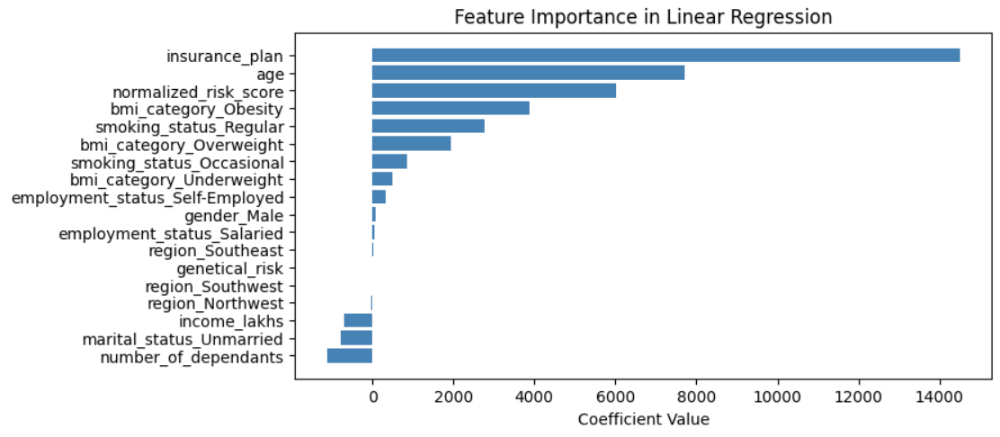
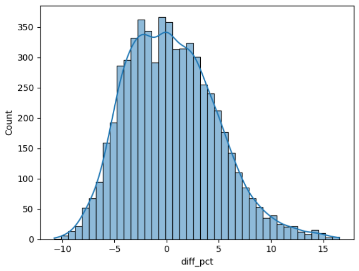
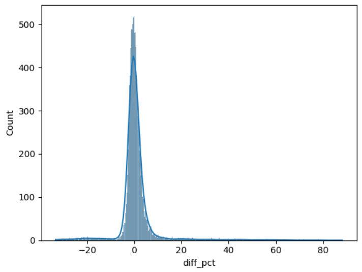

# 🏥 Health Insurance Premium Prediction System (Regression)


## 📋 Project Overview
A production-ready machine learning system that accurately predicts health insurance premiums using an **age-based segmentation strategy**.  
The system leverages **two specialized regression models** to capture distinct risk patterns across age groups and delivers real-time predictions through a professional **Streamlit web interface**.

This project demonstrates how **domain-aware model design** can significantly improve regression accuracy in real-world healthcare pricing problems.

---

## 🚀 Live Application



🔗 **Try the live app:**  
[Health Insurance Cost Predictor](https://health-insurance-cost-prediction-pro.streamlit.app/)

---

## 📊 Model Performance

### 1️⃣ Young Group (≤ 25 years)
- **Model:** Ridge Regression  
- **R² Score:** 0.9887  
- **RMSE:** 292.78  
- **Most Important Features:** Insurance Plan, Genetic Risk  

### 2️⃣ Adult Group (> 25 years)
- **Model:** XGBoost Regressor  
- **R² Score:** 0.9935  
- **RMSE:** 1717.70  
- **Most Important Features:** Insurance Plan, Age, Medical Risk  

---

## 📈 Feature Importance

### 1️⃣ Young Group Feature Impact


Insurance plan and genetic risk are the most influential factors for younger individuals.

### 2️⃣ Adult Group Feature Impact


Insurance plan, age, and medical risk dominate premium estimation for adults.

---

## 📊 Error Analysis

### 1️⃣ Young Group Error Distribution


- 95% of predictions fall within **±15% error margin**

### 2️⃣ Adult Group Error Distribution


- 90% of predictions fall within **±20% error margin**

---

## ⚙️ Installation

1. Clone & Install: 

```bash
git clone https://github.com/yourusername/ml-project-premium-prediction.git
cd ml-project-premium-prediction
pip install -r requirements.txt
```
2. **Run the app:**:   
```bash
streamlit run main.py
```

## 🎮 Key Features

- 12 Input Parameters: Age, income, medical history, lifestyle factors
- Dual-Model System: Specialized models for different age groups
- Medical Risk Scoring: Intelligent disease weight calculation
- Real-time Predictions: Instant premium estimates in ₹

## 📁 Project Structure

```bash
health-insurance-predictor/
│
├──  main.py                 # Streamlit application
│──  prediction_helper.py    # ML prediction logic
│   
│
├── artifacts/
│   ├── models/                 # Trained ML models
│
├── images/
│   └── screenshots/            # UI & result images

│
├── requirements.txt            # Project dependencies
├── README.md                   # Project documentation
└── .gitignore
```
👨‍💻 Author

Yoseph Negash

📧 yosephn22@gmail.com

📅 2026
